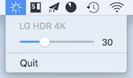

ExtBrightness: macOS GUI utility to control display brightness
---
This is a utility to control the brightness both build-in and external displays for macOS, and allow ultra-low brightness by modifying graphics card Gamma Table.

It will create a popover on status bar, where you can make various adjustment.

## Global Control Area
Using '+' or '-' button to increase or decrease all brightness value with a fixed amount (5%). With 'option' pressed, a step is 2%, while with 'shift' it is 10%.

## ExtDarkness
This area allow you to scale down all birghtness values by a ratio, which is in **dependent** from actual brightness. This allow you to make **ultra-low brightness**.

## Brightness Control
This area allow you to control brightness value of individual displays, using the sliders.

# Usage
Download and compile the project with Xcode. Start the program, and there will be an icon of 'sun' on the status bar.

It is developed and tested on:
* macOS High Sierra 10.13
* Xcode 9.4
* MacBook Pro 2017 13inch with TouchBar
* LG 27UK850-W, using USB-C

# How it works

Displays are catalogized into 4 types:
* **Build-in**. Build-in display can get fully controlled with native APIs (IODisplayGetFloatParameter() and IODisplaySetFloatParameter(), etc.)
* **External-native**. I call it 'native' because it is expected to get fully controlled with native APIs like build-in display.

Using some code from [Brightness Menulet](http://www.alecjacobson.com/weblog/?p=1127).

* **External-online**. Some monitors (maybe most third-party monitors) don't support the 'native' control method. However, we may still be able to control it using **DDC**.
> The Display Data Channel, or DDC, is a collection of protocols for digital communication between a computer display and a graphics adapter that enable the display to communicate its supported display modes to the adapter and that enable the computer host to adjust monitor parameters, such as brightness and contrast. (Wikipedia)

Some implementation code is from an excellent project [kfix/ddcctl](https://github.com/kfix/ddcctl).

It's called 'online' becaused brightness value and both read and set using DDC.

* **External-offline**. It's called 'offline' since the brightness can only be set but not read using DDC, such as my LG17UK850. However, we can still store the birghtness value in the program. If the brightness is not changed externally, we can still control it continuously. Also, for this kind of monitors, the program will set their brightness to 50% when it's first detected, to make it consistent with stored value. For the other three kinds of displays, the program will read their brightness values each time the popover pops up.

During an exection of the program, a *displayController* object will be created. If an 'offline' display disconnets, its data and slider will only be hidden instead of depreated, so when you connect it again, the brightness value will get remembered.

## ExtDarkness

This function is implement with thoughts and some code of setting 'fake' birghtness in another excellent project [ojotoxy/Brightness](https://github.com/ojotoxy/Brightness).

> Fake is supported on all monitors. This is done using the graphics card Gamma Table. Which basically maps RGB values to new RGB values. It is meant for color correction, but brightness correction is a subset of that. The original gamma table is read, and then scaled downward.

# Known Issues
* On my MacBook, it seems that the birghtness control on TouchBar Control Strip has its own local storage. The adjustment for build-in display by the progrom will no affect the value of the Touchbar slider.
* This program hasn't been fully tested, especially 'External Native' displays and 'External online' displays, since I don't have one. It would be great if you can report whether it works or not on your monitors. :)

# Other thoughts
* 'Ext' used to means 'external'. However, this program now supports build-in display. You can interpret it as 'extraordinary' or so :)
* There hasn't been hotkeys, start-up, displays configuration or data storage functions yet...
* The max birghtness values of external display is hard-coded as 100, which works for my LG monitor, but I am not sure whether it works for others. Maybe make it configurable.
* The On-Screen Control software of official LG can both read and write brightness and other configurations. I found there is an USB HID device of LG, but it's terrible seems terrible to look into the implementation of USB HID prototol...Also, it seems that LG uses an customed HID usage page...If any of you have thoughts about this, communications are all wellcomed :)
